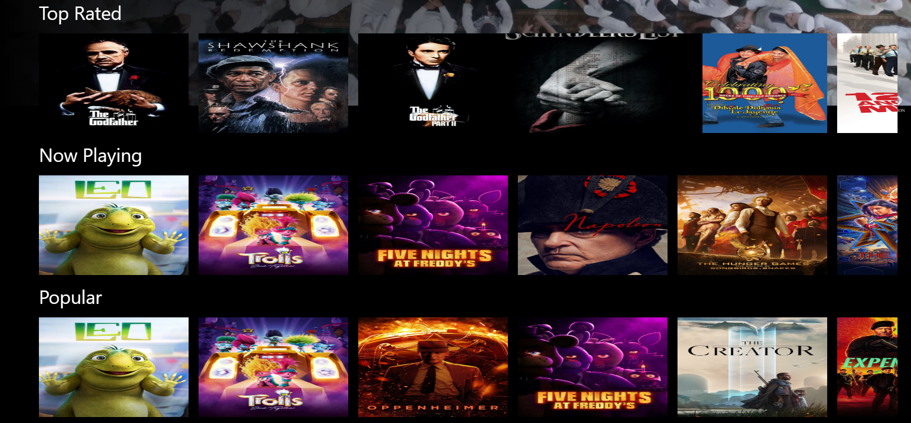
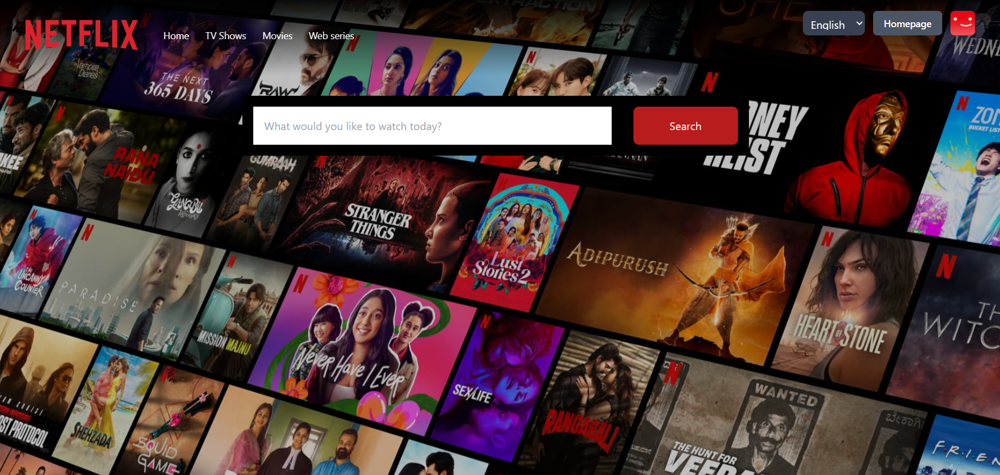
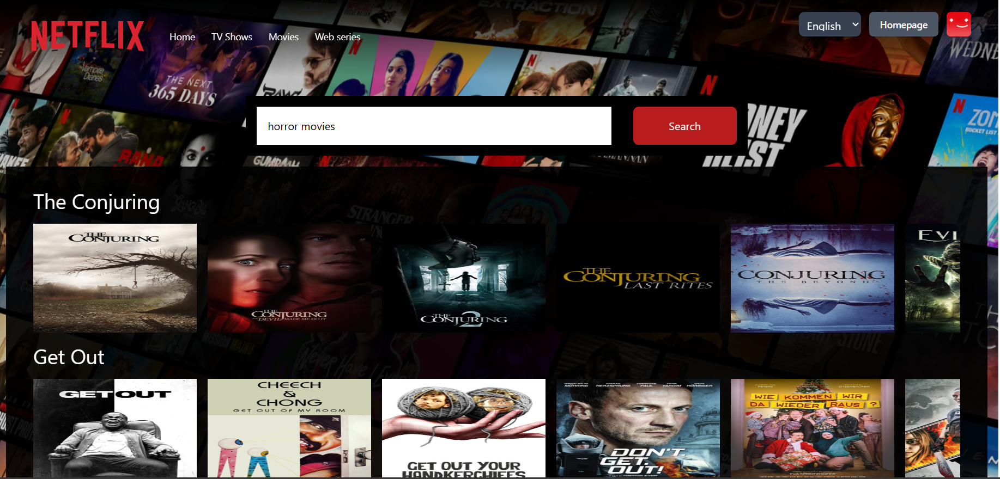

# Netflix GPT

Movies recomandation with AI.

## Setup

- Install react app using create-react-app (CRA)

```js
npx create-react-app netflix-gpt
```

- Install and init tailwind css

```js
npm install -D tailwindcss
npx tailwindcss init
```

- Configure tailwind css in your project

  `npx tailwindcss init` command will create a file `tailwind.config.js` in your project's root directory.
  Open `tailwind.config.js` and replace all content with below code.

```js
/** @type {import('tailwindcss').Config} */
module.exports = {
  content: ["./src/**/*.{js,jsx,ts,tsx}"],
  theme: {
    extend: {},
  },
  plugins: [],
};
```

- Add the @tailwind directives for each of Tailwind’s layers to your ./src/index.css file.

```css
@tailwind base;
@tailwind components;
@tailwind utilities;
```

- Now you created a react app with tailwind css successfully. Now run the below command on your terminal to start your local development server.

```js
npm start
```

## Features

- Home Page (is user !authorised)

  - Signin/Signup Page
    - SignInForm / SignUpForm

- Browse Page

  - Navbar
  - Showcase
  - Trendings
  - MoviesSuggestion
    - MoviesList \* N

- NetflixGPT
  - Search
  - MoviesSuggestion

## Screen Shot

Live Demo : [Live Demo]("Live Demo")

## Screen Shot

- Signin Page

  

- Signup Page

  

- Browse Page

  

- Movie List

  

- Search Page

  

- Movie results page

  

`<Happy coding />`

If you have any questions, suggestions, or just want to connect, feel free to reach out.

Feel free to modify it to suit the tone and style of your project. The goal is to encourage participation, collaboration and learning.

Made with ❤️ and React.